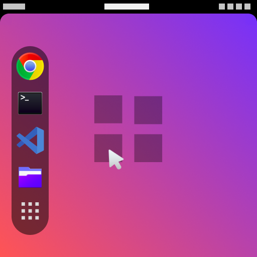

# Floating Dock

Floating dock is just a dash-to-dock fork, originaly made by Michele Gaio

now you can edit the margin and border-radius from the dock




# TODO

- add hook to Dash to Panel
- add abillity to use blur-provider
- option to disable notification bubble
- option to remove the application indicators
- More customization like, border-radius of app icon, zoom on hover icons


### Build Dependencies

To compile the stylesheet you'll need an implementation of SASS. Floating Dock supports `dart-sass` (`sass`), `sassc`, and `ruby-sass`. Every distro should have at least one of these implementations, we recommend using `dart-sass` (`sass`) or `sassc` over `ruby-sass` as `ruby-sass` is deprecated.

By default, Floating Dock will attempt to build with `dart-sass`. To change this behavior set the `SASS` environment variable to either `sassc` or `ruby`.

```bash
export SASS=sassc
# or...
export SASS=ruby
```

### Building

Clone the repository or download the branch from github. A simple Makefile is included.

Next use `make` to install the extension into your home directory. A Shell reload is required `Alt+F2 r Enter` under Xorg or under Wayland you may have to logout and login. The extension has to be enabled  with *gnome-extensions-app* (GNOME Extensions) or with *dconf*.

```bash
git clone https://github.com/fer-moreira/floating-dock.git
make
make install
```

## Bug Reporting

Bugs should be reported to the Github bug tracker [https://github.com/fer-moreira/floating-dock/issues](https://github.com/fer-moreira/floating-dock/issues).

## License
Floating Dock Gnome Shell extension is distributed under the terms of the GNU General Public License,
version 2 or later. See the COPYING file for details.
