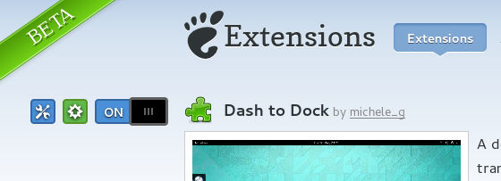

## Installation

### Compatibility
*Dash to Dock* extension is compatible with all systems capable of running **GNOME 3**, including **GNU/Linux** and *BSDs. It is compatible with all GNOME Shell version since GNOME 3.2, although more features and improvement have been added only to the most recent Shell version.

### Extension website
The easiest and suggested way to install and keep the extension updated is through the official [Gnome Shell Extensions site]({{ site.extension_page_url }}).

<ul id="button" style="max-width:100%;">
<li>
  
<a class="download" href="{{ site.extension_page_url }}">Try it out</a>

  
Install the extension through the <a href="{{ site.extension_page_url }}">extensions website</a>. The installation process is as simple as sliding a button.

</li>
</ul>

The installation process is as simple as sliding a button. The extension can then be enabled and disabled through the same site or with *gnome-tweak-tool*.

### Manual installation
You can also obtain the extension in the form of a *zip archive* from the [release page](.{{ site.release_page_url }}). Look for the latest version supporting your shell version. The extension can be installed by means of *gnome-tweak-tool* or alternatively by directly extracting the archive in the a directory named <code>dash-to-dock@micxgx.gmail.com</code> inside <code>~/.local/share/gnome-shell/extensions/</code>

     unzip dash-to-dock@micxgx.gmail.com.zip \ 
    -d ~/.local/share/gnome-shell/extensions/dash-to-dock@micxgx.gmail.com/

Shell reload is required <code>Alt+F2 r Enter</code>. The extension can be enabled with *gnome-tweak-tool* or with *dconf* by adding 'dash-to-dock@micxgx.gmail.com' to the <code>/org/gnome/shell/enabled-extensions</code> key.

### Installation from source
The extension can be installed directly from source, either for the convenience of using *git* or to test the latest development version. Clone the desired branch with git

     git clone https://github.com/micheleg/dash-to-dock.git

or download the branch from github. The *master* branch usually target the latest GNOME Shell version. There are *gnome-3.x* branch with the latest code for older versions. In case you are running a development version ( that is an even version), although the extension is not guaranteed to work, you should look for a development branch and manually add your version in the metadata.json. Sometimes the previous stable version works with minor bugs also in the development GNOME Shell.

A simple Makefile is included. Run

    make
    make install

to install the extension in your home directory. A Shell reload is required <code>Alt+F2 r Enter</code> and the extension has to be enabled  with *gnome-tweak-tool* or with *dconf*.

As an alternative the zip archive can be generated with 

    make
    make zip-file

Then follow the instructions above to install the zip-archive.
