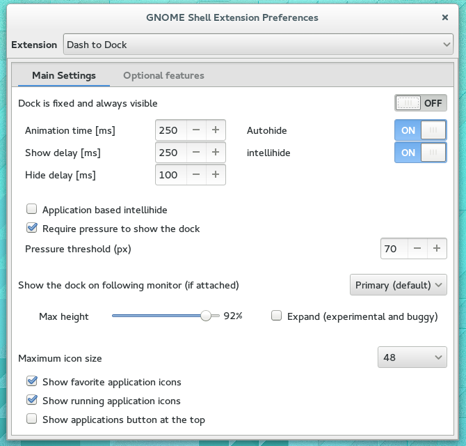
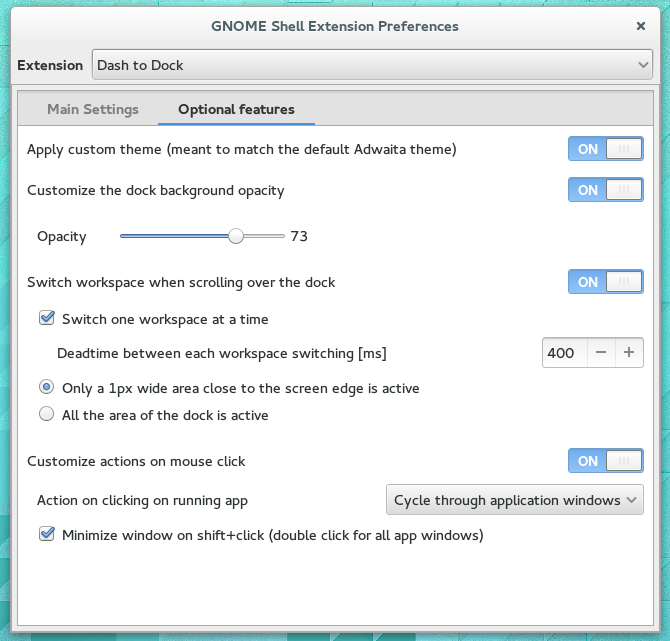

## Extension settings
The extension can be configured extensively by means of *gnome-shell-extension-prefs*,  clicking the configure button on the [extension page]({{ site.extension_page_url }}) next to the enable/disable button or running gnome-shell-extension-prefs in a console. To open the Dash to Dock settings directly run

    gnome-shell-extension-prefs dash-to-dock@micxgx.gmail.com

