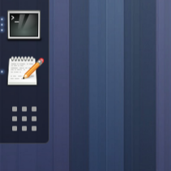

## Themes
The extension aims to be as **theme-friendly** as possible. Although the dock appearence is inherited from the default dash ensuring always basic theme support,  some themes target dash to dock specifically. For more information on the theming support visit the [theming development section](./theming.html).

### Adwaita Dash to Dock 

An **extended Adwaita**, the default theme, is available. Compared with the defaut theme, this theme only applies minor changes to the dash as shown on the screenshot.

 * reduce the padding to save space.
 * and adds dots indicating running application.

The theme can be downloaded from the [theme development page] (https://github.com/micheleg/adwaita-dashtodock).

### Other themes supporting the extension
The following themes are known to support Dash to Dock extension:

 * **LittleBigMod 2nd**, [(http://gnome-look.org/content/show.php/?content=152088)](http://gnome-look.org/content/show.php/?content=152088)
 * **Energreen_Suiteby**  by Astral-1, [http://astral-1.deviantart.com/art/Energreen-Suite-321855454](http://astral-1.deviantart.com/art/Energreen-Suite-321855454)

If you know or you authored a theme supporting dash to dock and you want to see it listed here, please contact me.
